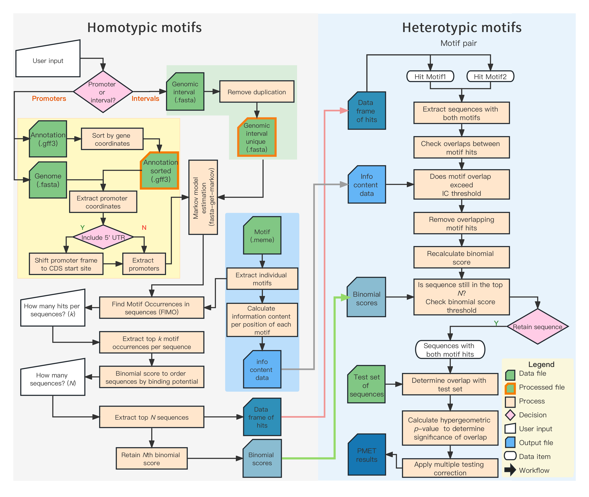

This is a Shiny app developed for PMET.


## File tree

```shell
.
├── PMETdev        # PMET/PMET_index (source code)
├── R              # r code of Shiny app
│   ├── app.R      # integrate all UIs and Servers
│   ├── global.R   # packages and configs needed in shiny app
│   ├── module     # modulaity of shiny heatmap (ggplot) and data-table view
│   ├── server     # server side of shiny
│   ├── ui         # UI-side of shiny
│   └── utils      # R functions
├── app.R          # start shiny app
├── data           # demo data for PMETindex and PMET
│   ├── indexing   # prepared pmet indexing
├── readme.md
├── www            # JS with D3 for heatmap, used in tab_visualize.R
└── result         # result of Shiny app
```

## Pre-computed PMET indexing data
Given that the PMET indexing calculation takes a very long time, we have already performed pre-calculation for some plants and several common plant transcription factor databases.
```
data/indexing
|-- Arabidopsis_thaliana
│   |-- CIS-BP2
│   |-- Franco-Zorrilla_et_al_2014
│   |-- PlantTFDB
│   `-- universe.txt
|-- Brachypodium_distachyon
|-- Brassica_napus
|-- Glycine_max
|-- Hordeum_vulgare
|-- Hordeum_vulgare_Morex_V3
|-- Hordeum_vulgare_R1
|-- Hordeum_vulgare_goldenpromise
|-- Hordeum_vulgare_v082214v1
|-- Medicago_truncatula
|-- Oryza_sativa_indica_9311
|-- Oryza_sativa_indica_IR8
|-- Oryza_sativa_indica_MH63
|-- Oryza_sativa_indica_ZS97
|-- Oryza_sativa_japonica_Ensembl
|-- Oryza_sativa_japonica_Kitaake
|-- Oryza_sativa_japonica_Nipponbare
|-- Oryza_sativa_japonica_V7.1
|-- Solanum_lycopersicum
|-- Solanum_tuberosum
|-- Triticum_aestivum
`-- Zea_mays
```

In the future, if there are more plants or new databases to be added to the shiny app, we just need to copy the new indexing results to the indexing directory. the PMET shiny app will automatically recognize the new additions without the need to change the code.


## Install GNU Parallel

GNU Parallel helps PMET index (FIMO and PMET index) to run in parallel mode.

```bash
sudo apt-get install parallel
```

Put GNU Parallel silent:

```bash
 # Run once
 parallel --citation
```

## Install The MEME Suite (FIMO and fasta-get-markov)

```bash
# cd a folder you want to put the software
wget https://meme-suite.org/meme/meme-software/5.5.2/meme-5.5.2.tar.gz

tar zxf meme-5.5.2.tar.gz
cd meme-5.5.2
./configure --prefix=$HOME/meme --enable-build-libxml2 --enable-build-libxslt
make
make test
make install
```

Add following into bash profile file.

```bash
# assuming you put meme folder under your home folder
export PATH=$HOME/meme/bin:$HOME/meme/libexec/meme-5.5.2:$PATH
```

## Install samtools

Install from conda or mamba:

```bash
conda install -c bioconda samtools
```

Install from source:

> assuming you create a directory named `samtools` in home directory (~) and install samtools there.

```bash
wget https://github.com/samtools/samtools/releases/download/1.17/samtools-1.17.tar.bz2

cd samtools-1.17    # and similarly for bcftools and htslib
./configure --prefix=$HOME/samtools
make
make install

# Add following into bash profile file or .zshrc (if zsh used).

# assuming you put samtools-1.17 folder under your home folder
export PATH=$HOME/samtools/bin:$PATH
```

## Install bedtools

It is recommended to install bedtools via apt/yum or conda.

```bash
conda install -c bioconda bedtools
```

or

```bash
conda install bedtools

# Debian/Ubuntu
apt-get install bedtools

# Fedora/Centos
yum install BEDTools
```

It is possible to compile the bedtools by running the following commands.

```bash
wget https://github.com/arq5x/bedtools2/releases/download/v2.29.1/bedtools-2.29.1.tar.gz
tar -zxvf bedtools-2.29.1.tar.gz
cd bedtools2
make
```

## Python libraries

```bash
pip install numpy
pip install pandas
pip install scipy
pip install bio
pip install biopython
```

## Setup Shiny server and nginx

Please follow [Shiny Server Deployment](https://cran.r-project.org/web/packages/ReviewR/vignettes/deploy_server.html) for more details.

**Shiny config**

Once Shiny Server is installed, you can access the Shiny Server welcome page by visiting your local IP address followed by port 3838 (127.0.0.1:3838 in your PC, if not in a server with a static IP ).

The configuration file for Shiny Server is located at `/etc/shiny-server/shiny-server.conf`. Various parameters can be modified in this file. By default, newly created Shiny app projects should be stored in `/srv/shiny-server`, allowing Shiny Server to access and render them as web pages.

You can either directly copy the `pmet` folder to `/srv/shiny-server` or create a link to it in that directory.

```bash
ln -s /home/shiny/pmet_nginx /srv/shiny-server
```


**nginx config**

Add the following in the end of `/etc/nginx/sites-enabled/default`

```shell
# vim /etc/nginx/sites-enabled/default
server {
        listen 127.0.0.1:84;
        server_name 127.0.0.1;
        location /result {
                alias /home/shiny/pmet_nginx/result;
        }
}
```

**Download function based on nginx**

After PMET calculation is completed, Shiny will generate a download button that is specifically for the PMET result archive. This functionality can be found in `utils/command_call_pmet.R` line 115.

```R
result_link <- paste0("http://127.0.0.1:84/result/", paste0(pmetPair_path_name, ".zip"))
```

### CPU

Currently, PMET uses 4 CPU cores by default. If you have abundant computing resources, you can modify the -t parameter in `utils/command_call_pmet.R`. It seems that 4 CPU cores should be sufficient for the performance.


## R packages

To avoid any inconvenience, I will provide you with the required R packages here.

```R
install.packages("devtools")
install.packages("remotes")

library(remotes)

remotes::install_github("daattali/shinydisconnect")
remotes::install_github("RinteRface/fullPage")
remotes::install_github("dreamRs/shinybusy")
remotes::install_github("merlinoa/shinyFeedback", build_vignettes = TRUE)
remotes::install_github("daattali/shinycssloaders")
remotes::install_github("dreamRs/shinyWidgets")

# Used packages
packages <- c(
  "bslib",                # Bootstrap themes and styles
  "data.table",           # efficient handling of large datasets
  "DT",                   # interactive data tables
  "dplyr",                # Provides powerful data manipulation and operations
  "future",               # support for parallel and asynchronous programming
  "ggasym",               # symmetric scatter plots and bubble charts
  "ggplot2",              # creation of beautiful graphics
  "ggpubr",               # graph publication-ready formatting and annotations
  "glue",                 # string interpolation and formatting
  "jsonify",              # JSON data processing and transformation
  "kableExtra",           # creation of nice tables and adding formatting
  "mailR",                # Interface to Apache Commons Email to send emails from R
  "openxlsx",             # reading and writing Excel files
  "promises",             # deferred evaluation and asynchronous programming
  "reshape2",             # data reshaping and transformation
  "rintrojs",             # interactive tour integration
  "RinteRface/fullPage",  # Create full page scrollable web pages with Shiny and R Markdown
  "rjson",                # Converts R object into JSON objects and vice-versa
  "shiny",                # creation of interactive web applications
  "shinyBS",              # Bootstrap styling
  "shinybusy",            # Automated (or not) busy indicator for Shiny apps & other progress / notifications tools
  "shinydashboard",       # creation of dashboard-style Shiny apps
  "shinyFeedback",        # user feedback integration
  "shinycssloaders",      # loading animation integration
  "shinyjs",              # JavaScript operations
  "shinythemes",          # theme customization
  "shinyvalidate",        # form validation
  "shinyWidgets",         # creation of interactive widgets
  "scales",               # data scaling and transformation
  "tibble",               # extended data frames
  "tidyverse",            # a collection of R packages for data manipulation and visualization
  "tictoc",               # simple and accurate timers
  "zip",                  # creation and extraction of ZIP files
  "fa"
)


installed_packages <- character()
failed_packages    <- character()

for (package in packages) {
  if (require(package, character.only = TRUE)) {
    installed_packages <- c(installed_packages, package)
  } else {
    tryCatch(
      {
        suppressMessages(install.packages(package, repos = "https://cran.r-project.org", dependencies = TRUE, type = "source"))
        if (require(package, character.only = TRUE)) {
          installed_packages <- c(installed_packages, package)
        } else {
          failed_packages <- c(failed_packages, package)
          message(paste("Installation of", package, "failed."))
        }
      },
      error = function(e) {
        failed_packages <- c(failed_packages, package)
        message(paste("Installation of", package, "failed."))
      }
    )
  }
}


# Print installed packages
cat("The installed packages are as follows:\n")
print(installed_packages)

# Print failed packages
if (length(failed_packages) > 0) {
  cat("\nThe following packages could not be installed:\n")
  print(failed_packages)
} else {
  cat("\nAll packages were successfully installed.\n")
}
```

## PMET index and PMET

Both are writen in C++, source code can be found in `PMETdev/src/indexing` and `PMETdev/src/pmetParallel`.

If necessary, it is possible to compile pmet index and pmet in different OS.

**PMET index**

```bash
# PMETdev/src/indexing
./build.sh
```

or

```bash
# PMETdev/src/indexing
g++  -g -Wall -std=c++11 cFimoFile.cpp cMotifHit.cpp fastFileReader.cpp main.cpp -o ../../scripts/pmetindex
```

**PMET**

```bash
# PMETdev/src/pmetParallel
./build.sh
```

or

```bash
# PMETdev/src/pmetParallel
g++ -g -Wall -std=c++11 Output.cpp motif.cpp motifComparison.cpp main.cpp -o ../../scripts/pmetParallel_linux -pthread
```




[GitHub Ribbons](https://github.blog/2008-12-19-github-ribbons/)
[GitHub Corners](https://tholman.com/github-corners/)